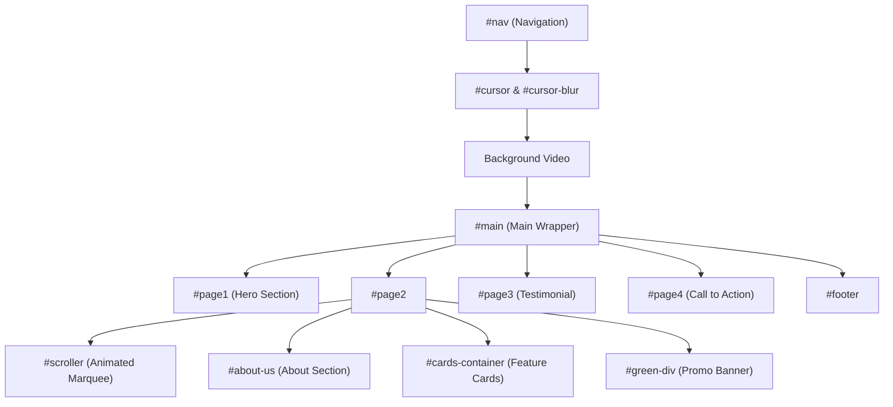
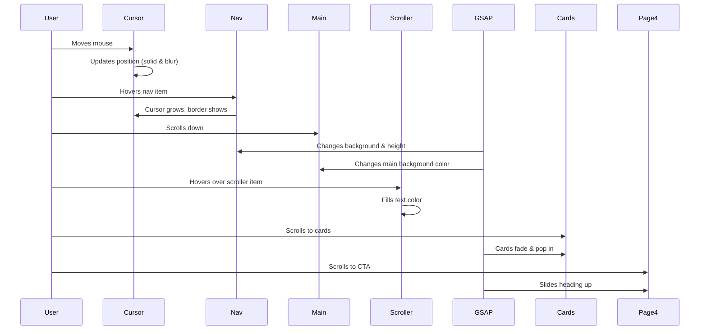

# Sidcup Website Clone Documentation

This documentation covers the Sidcup Website Clone project, which is a modern, interactive, and responsive recreation of the official [Sidcup Family Golf site](https://sidcupfamilygolf.com/). You can view the deployed clone here: [https://sidcup-website-clone.vercel.app/](https://sidcup-website-clone.vercel.app/).

The clone demonstrates advanced UI/UX techniques, smooth animations, and thoughtful responsiveness, all crafted with HTML, CSS, JavaScript, and GSAP (GreenSock Animation Platform).

---

## 🌟 Project Overview

The Sidcup Website Clone offers:

- A pixel-perfect recreation of Sidcup Family Golf’s homepage.
- Custom cursor effects and immersive scroll-triggered animations.
- Responsive layouts for desktop, tablet, and mobile devices.
- Interactive elements like animated scrollers and hover overlays.
- Modern design patterns using external fonts and icons.

This project is a showcase of advanced front-end skills, focusing on animation, user experience, and mobile adaptation.

---

## File Structure

| File          | Description                                             |
|---------------|---------------------------------------------------------|
| `index.html`  | The main HTML file, structures all visible content.     |
| `style.css`   | Powerful custom CSS for layout, animation, and effects. |
| `script.js`   | JavaScript for UI interactivity and animation (GSAP).   |

---

# index.html

This is the main HTML document that lays out the structure and content for the Sidcup Website Clone.

## Key Features

- **Semantic Structure**: Uses descriptive IDs and class names for clarity.
- **External Assets**: Loads Google Fonts (`Montserrat`, `Poppins`), Remixicon, and GSAP via CDN.
- **Custom Cursor Elements**: Includes `#cursor` and `#cursor-blur` for animated cursor effects.
- **Background Video**: Uses a fixed video background for dynamic visual appeal.
- **Sectioned Layout**: Divides content into logical blocks: navigation, hero, scroller, about, cards, review, call-to-action, and footer.
- **Mobile Responsive**: Layout adapts to all screen sizes.

### Major Sections Breakdown

| Section            | Purpose                                               |
|--------------------|------------------------------------------------------|
| `#nav`             | Sticky navigation bar with site logo and links        |
| `#cursor`/`#cursor-blur` | Custom animated cursor layers                  |
| `<video>`          | Fixed hero background video                          |
| `#main`            | Main content wrapper, semi-transparent overlay       |
| `#page1`           | Hero section with main heading and intro text        |
| `#page2`           | Contains scroller, about-us, cards, promo banner     |
| `#scroller`        | Animated marquee of feature links                    |
| `#about-us`        | About information with images and description        |
| `#cards-container` | Feature cards with hover overlays                    |
| `#green-div`       | Promotional sign-up call-to-action                   |
| `#page3`           | Review/testimonial section with quote graphics       |
| `#page4`           | Image grid with overlay headings                     |
| `#footer`          | Contact, links, and branding info                    |

### Example: Navigation and Cursor

```html
<div id="nav">
  
  <h4>TOPTRACER RANGE</h4>
  <h4>Golf Lessons</h4>
  ...
</div>
<div id="cursor">
  <div id="cursor-blur"></div>
</div>
```

### Example: Scroller Animation

```html
<div id="scroller">
  <div id="scroller-in">
    <h4>TOPTRACER RANGE</h4>
    <h4>GOLF LESSONS</h4>
    ...
  </div>
  <div id="scroller-in">
    <!-- Duplicated for continuous scroll effect -->
    ...
  </div>
</div>
```

---

## 📊 Homepage Structure Flow



---

# style.css

The `style.css` file contains all visual styling, layout, custom effects, and responsiveness for the site.

## Major Features

- **Global Reset and Base Styles**
    - Removes default margins/paddings, sets `box-sizing: border-box`.
    - Uses Montserrat as the primary font, with white text color.
    - Customizes text selection and browser scrollbars for aesthetics.

- **Custom Cursor**
    - `#cursor` and `#cursor-blur` create a glowing, animated circular cursor and blur effect.
    - Both elements are positioned fixed and layered above content.

- **Navigation Bar**
    - Fixed at the top, semi-transparent background.
    - Uses flex for layout and gap between items.
    - Responsive adjustments for tablets and mobile.

- **Background Video**
    - Covers the entire viewport, fixed behind all content.

- **Hero Section**
    - Large, bold heading with an outlined shadow effect.
    - Centered intro text and a circular arrow button with hover transitions.

- **Animated Scroller**
    - Uses `@keyframes scroll` for infinite horizontal marquee effect.
    - On hover, text fills with green color (`#95C11E`), implemented via transition and controlled in JS for smoothness.

- **About and Cards**
    - Flex layouts for desktop, column layouts for mobile.
    - Cards have hover overlays with transition; images scale/rotate for interactivity.

- **Green Promo Banner**
    - Linear gradient background with centered, bold text and decorative images.

- **Testimonial Section**
    - Centered, large text with floating quote graphics.

- **Page4 Call-to-Action**
    - Large heading, grid of image elements that reveal images on hover.

- **Footer**
    - Gradient background, multi-column layout with branding, links, and contact info.
    - Responsive stacking on mobile.

- **Responsiveness**
    - Uses two major media queries for tablets (`max-width: 48rem`) and mobile (`max-width: 26.5625rem`).
    - Adjusts paddings, font sizes, flex directions, and element visibility for usability on all devices.

## Example: Custom Cursor CSS

```css
#cursor {
  height: 20px;
  width: 20px;
  background-color: #95C11E;
  border-radius: 50%;
  position: fixed;
  z-index: 99;
  pointer-events: none;
}
#cursor-blur {
  height: 500px;
  width: 500px;
  background-color: #95C11e2b;
  border-radius: 50%;
  position: fixed;
  filter: blur(40px);
  z-index: 9;
  pointer-events: none;
}
```

---

## 🎨 Responsive Design Highlights

- **Navigation** collapses into a compact bar on mobile.
- **Hero Section** text and arrow resize for clarity.
- **About, Cards, and Footer** stack vertically on small screens.
- **Scroller** font sizes and paddings adjust for touch usability.

---

# script.js

The JavaScript file powers interactivity, custom cursor behavior, and GSAP-based animations.

## Functionality Breakdown

### Custom Cursor

- Tracks mouse movement and positions both the solid and blurred cursor elements for a glowing effect.
- On hover over navigation items, the cursor grows, becomes outlined, and turns transparent for feedback.

```js
document.addEventListener("mousemove",function(dets){
  crsr.style.left = dets.x +"px"
  crsr.style.top = dets.y+"px"
  crsrblur.style.left = dets.x -250 +"px"
  crsrblur.style.top = dets.y - 250 +"px"
});
```

### Navigation Bar Animation

- Uses GSAP to animate the navigation bar's background and height when the user scrolls past a threshold.

```js
gsap.to("#nav", {
  backgroundColor : "#000",
  height: "110px",
  duration: 0.5,
  scrollTrigger: {
    trigger:"#nav",
    scroller: "body",
    start: "top -10%",
    end: "top -11%",
    scrub: 1
  }
})
```

### Main Content Animation

- The background of the main content transitions to black as the user scrolls deeper.

```js
gsap.to("#main", {
  backgroundColor : "#000",
  scrollTrigger : {
    trigger: "#main",
    scroller: "body",
    start: "top -25%",
    end: "top -70%",
    scrub: 2
  }
})
```

### Animated Scroller Text

- Uses requestAnimationFrame to track mouse position and determine if it's hovering over a `<h4>` in the scroller.
- When hovering, the text color fills in; otherwise, it remains transparent with a stroke.

```js
function checkHover() {
  scrollerH4s.forEach(h4 => {
    const rect = h4.getBoundingClientRect();
    if (mouseX >= rect.left && mouseX <= rect.right && mouseY >= rect.top && mouseY <= rect.bottom) {
      h4.style.color = "#95C11E";
    } else {
      h4.style.color = "transparent";
    }
  });
  requestAnimationFrame(checkHover);
}
checkHover();
```

### GSAP Scroll Animations

- About section and cards fade/slide in on scroll.
- Decorative quote images float in.
- Call-to-action heading slides up into view.

```js
gsap.from("#about-us img,#about-us-in", {...});
gsap.from(".card", {...});
gsap.from("#colon1", {...});
gsap.from("#colon2", {...});
gsap.from("#page4 h1", {...});
```

---

## ⚡ UI Animation Sequence



---

## 🧩 Integration and Flow

All files work together seamlessly:

- **index.html** provides structure and links CSS/JS.
- **style.css** crafts the visual, responsive, and animated feel.
- **script.js** detects user input for interactive effects and launches scroll-based animations at the right times.

---

## 📱 Responsive Design

This clone is fully responsive, ensuring:

- Navigation collapses and simplifies on mobile.
- Hero text, sections, and images resize and stack for readability.
- Hover and cursor effects gracefully degrade or hide on touch devices.

---

## 🏆 Best Practices and Highlights

```card
{
    "title": "Best UX Practices",
    "content": "Uses scroll-triggered animations, custom cursor, and mobile responsiveness for immersive user experience."
}
```

```card
{
    "title": "Performance & Accessibility",
    "content": "Animations are GPU-accelerated; selectors are efficient; layout adapts for readability and touch support."
}
```

---

## 💡 Key Customizations

- **Animated Custom Cursor**: Adds a premium feel and unique brand touch.
- **GSAP Integration**: Enables smooth, performant animations.
- **Continuous Marquee**: Keeps users engaged with animated scroller.
- **Hover Overlay Cards**: Surfaces additional information interactively.

---

## 🖼️ Visual Inspiration

This project is a faithful clone of [sidcupfamilygolf.com](https://sidcupfamilygolf.com/), using similar layout, fonts, colors, and interactive cues.

---

## 📝 Conclusion

The Sidcup Website Clone demonstrates advanced front-end engineering and design skills. It is ideal as a learning resource for:

- Responsive web design.
- Modern CSS/JS animation.
- Interactive UI/UX without frameworks.

For a live demo, visit: [https://sidcup-website-clone.vercel.app/](https://sidcup-website-clone.vercel.app/)

---

**If you wish to expand this project, consider adding:**

- Real API integration for news sign-ups.
- More detailed pages for each section.
- Progressive enhancement for accessibility.

---

**This documentation covers all files, providing clear insight into structure, styles, behaviors, and advanced animation logic.**
